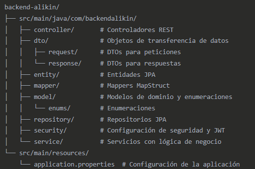

# Este README esta incompleto
## Aqui se subiran los changes hasta el momento

# Proyecto Alikin - Red Social Musical

## Componentes implementados

### 1. Estructura del proyecto
- Organización de paquetes siguiendo las mejores prácticas de Spring Boot
- Separación de capas (controladores, servicios, repositorios)
- Configuración base con Maven

### 2. Modelos y entidades
- **Usuarios**: Perfiles, sistema de seguidores, autenticación
- **Publicaciones**: Con sistema de votos similar a Reddit
- **Comentarios**: Para interacción en publicaciones
- **Comunidades**: Con roles y gestión de miembros
- **Música**: Canciones, géneros, playlists y "radio" de comunidad

### 3. Autenticación y seguridad
- Sistema completo basado en JWT
- Registro e inicio de sesión de usuarios
- Autorización basada en roles y propiedad de recursos
- Protección de endpoints sensibles

### 4. API REST
- Controladores para todas las entidades principales
- Endpoints completos para operaciones CRUD
- Gestión de relaciones (seguir usuarios, unirse a comunidades, etc.)
- Streaming de archivos de audio

### 5. Almacenamiento de archivos
- Sistema para subir, almacenar y recuperar archivos
- Organización en directorios según tipo de archivo
- Generación de nombres únicos para evitar colisiones

### 6. Mapeo y conversión de datos
- DTOs para peticiones y respuestas
- Mappers con MapStruct para conversión entre entidades y DTOs
- Gestión eficiente de relaciones circulares

## Tecnologías utilizadas

- **Spring Boot 3.x**: Framework base
- **Spring Security**: Para autenticación y autorización
- **Spring Data JPA**: Para acceso a datos
- **PostgreSQL**: Base de datos relacional
- **MapStruct**: Mapeo objeto-objeto
- **JWT**: Autenticación basada en tokens
- **Docker**: Contenedores para desarrollo y despliegue

## Funcionalidades principales

### Para usuarios
- Registro e inicio de sesión
- Perfiles personalizables
- Seguir a otros usuarios
- Feed personalizado con publicaciones

### Para publicaciones
- Crear publicaciones con texto, imágenes y/o música
- Sistema de votos positivos y negativos
- Comentarios en publicaciones
- Filtrado por comunidades

### Para comunidades
- Creación y gestión de comunidades temáticas
- Roles (líder, miembro)
- Radio de comunidad (playlist compartida)

### Para música
- Subida y almacenamiento de canciones
- Creación de playlists personales
- Reproductor integrado
- Categorización por géneros

## Pendiente por implementar

### 1. Tests
- Pruebas unitarias para servicios
- Pruebas de integración para controladores
- Pruebas end-to-end

### 2. Frontend
- Desarrollo de la interfaz de usuario con Angular
- Integración con la API REST
- Reproductor de música en el cliente

### 3. Características adicionales
- Verificación de email
- Recuperación de contraseña
- Búsqueda avanzada
- Sistema de notificaciones
- Estadísticas de reproducción
- Recomendaciones basadas en gustos
